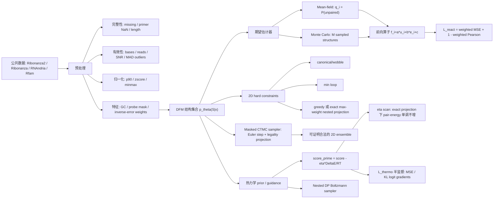
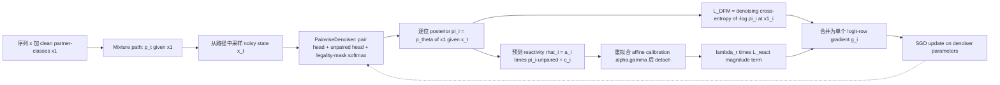
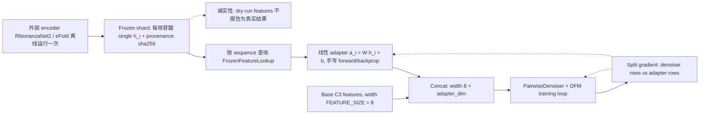
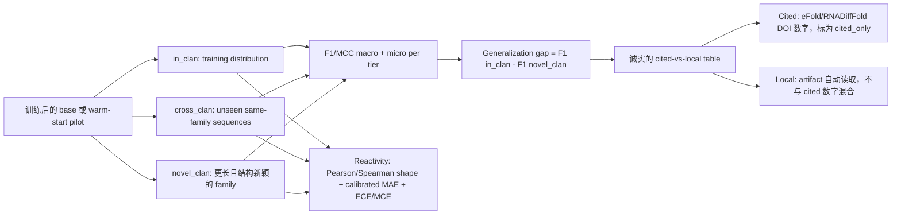

# ReactFlow

ReactFlow 是 [`ReactFlow_research_plan.md`](ReactFlow_research_plan.md) 中研究方案的 Python 实现脚手架，目标是用 reactivity-consistency objective 学习 RNA 二级结构集合。

当前状态：**C1-C6 的核心实现已经落地，full-scale real-data 消融正在服务器运行**。仓库目前包含数据源清单、预处理检查、reactivity 前向算子、期望估计器、二级结构合法性约束（贪心投影和精确最大权 nested projection）、热力学 guidance surrogate、带手写反向传播的 discrete flow matching（DFM）配对分布模型、端到端 `L_DFM + lambda_r * L_react` 训练循环、可采样合法二级结构集合的 masked CTMC sampler、热力学半监督损失 `L_thermo`、推理阶段 energy-guidance `eta` 扫描及其单调性保证、**Stage-A warm-start 路径**（冻结外部 encoder 特征 + 手写线性 adapter，见 [`frozen.py`](src/reactflow/frozen.py) 和 [`features.py`](src/reactflow/features.py)）、**分层评测协议**（F1/MCC macro+micro、generalization gap、Pearson/Spearman、calibrated MAE、ECE/MCE，以及诚实区分 cited/local 的对比表，见 [`evaluate.py`](src/reactflow/evaluate.py)）、H3/H4 domain-specific losses（contact denoising + heteroscedastic ensemble calibration）、SymPy 推导验证、SVG 诊断图和 pytest 覆盖率。

阶段性汇报见 [`docs/project_status_report.md`](docs/project_status_report.md)。该文档汇总当前已完成模块、真实数据与 split 状态、远端 full-scale 实验进度、cross-family 指标、剩余 hard gate 和下一步实验计划。

SOTA 追赶目标、指标对齐矩阵、scale-up 路线和逐项 todo 见 [`docs/sota_catchup_goals_and_todo.md`](docs/sota_catchup_goals_and_todo.md)。后续所有 RF-CF / baseline rerun / 10-seed 统计工作都以这份文档作为主执行清单。

DFM 模型已经在**明确标注的确定性 synthetic pilot 数据集**上端到端跑通（见 [`synthetic.py`](src/reactflow/synthetic.py)），也可以通过 warm-start adapter 消费**作为数据冻结下来的 encoder 特征**。整条 warm-start + evaluation pipeline 可以离线运行在一个**dry-run frozen shard** 上（确定性随机特征，`weights_sha256=""`），也已经跑通过**真实 eFold/RNAndria 结构数据 smoke run**：Dryad JSON 记录会被转换为 DFM training samples，RibonanzaNet2 Kaggle-alpha checkpoint 特征会用真实 `weights_sha256` 导出，`reactflow train-efold` / `reactflow evaluate-efold` 可以训练并评估具名 benchmark tiers。

因此，项目现在是**真正可训练、可复现、可端到端使用**的，但 full-scale 远端 artifact 必须以文件实体审计为准。RibonanzaNet2 full frozen-feature manifest 已恢复到 `409` 个 shards / `208,905` 条 unique windows，并通过真实 Kaggle-alpha checkpoint hash 审计（`weights_sha256=c94031719c8a...`）。warm/contact/MMseqs 三份 full-scale final-result 文件已经生成并通过 7-tier 内容契约；RF-CF 自动链路已在 frozen readiness 后启动。RF-CF3 family-balanced 已完成但未达标（`novel_clan_mean_f1=0.0286`，`cross_family_claim_ready=false`），RF-CF1 contact sweep 正在远端 `editflow` 环境接力运行；项目还**没有**完成同协议 baseline 复现和多 seed 统计，因此在这些结果归档前不声明任何 leaderboard/SOTA 数字。

## 科学问题与定制化模型路线

ReactFlow 的核心科学问题不是“再做一个从序列预测单个二级结构的模型”，而是：

> **在 RNA 结构标签稀缺、chemical probing 只提供结构集合的一阶观测、并且训练/测试家族必须严格隔离的条件下，能否学习一个物理约束的 RNA 二级结构分布 `p_theta(S | x)`，使其既能解释 DMS/SHAPE reactivity，又能在 Rfam-clan / MMseqs-disjoint 的未知 RNA family 上泛化？**

这里的目标变量不是单个 dot-bracket，而是合法二级结构集合上的概率分布。给定 RNA 序列 `x`，结构 `S` 属于合法集合 `Omega(x)`：每个碱基最多配对一次、配对类型满足 canonical/wobble 约束、满足 minimum-loop，并可选择 nested projection 或更宽松的 pseudoknot-aware relaxation。chemical probing 观测 `y` 不是结构标签，而是从结构集合经过 probe-specific forward operator 后得到的带噪声、带 mask 的 ensemble moment：

```text
y_i^(probe) ~= E_{S ~ p_theta(S | x)}[f_i^(probe)(S, x)] + noise
```

因此，ReactFlow 要解决的是一个**带物理约束和观测模型的弱监督分布学习问题**。这和普通 Transformer contact predictor、普通 diffusion contact-map segmenter 或简单地 fine-tune 大模型不同：那些模型通常直接预测 contact map 或单结构，而 ReactFlow 明确建模“结构分布 -> chemical probing signal”的生成关系，并把合法性、热力学先验和 OOD 评测作为模型定义的一部分。

### 为什么不能只用通用架构

通用架构（例如 `sequence -> Transformer -> contact map`）不足以直接回答这个科学问题，原因有四个：

1. **chemical probing 是 ensemble observation，不是单结构标签。** 同一个 reactivity profile 可以由多个结构集合解释，模型必须显式处理不可辨识性，而不是把 reactivity 当作普通回归标签。
2. **二级结构有硬约束。** 不加 canonical/wobble、one-pair-per-base、minimum-loop 和投影约束时，模型可能得到高分但化学上非法的 contact map。
3. **RNA 结构预测存在强烈 family leakage 风险。** 随机 split 会高估性能；必须在 Rfam clan 和 sequence-identity cluster 层面验证 OOD 泛化。
4. **我们关心的是分布与校准，而不只是 F1。** 论文主张需要同时报告 novel-clan F1/MCC、reactivity consistency、ensemble calibration、generalization gap 和消融结果。

### 为科学问题定制的模型架构

ReactFlow 的架构按科学难点逐项设计，而不是从通用模型模板出发：

| 科学难点 | 定制化组件 | 作用 | 当前状态 |
|---|---|---|---|
| 目标是结构分布而非单结构 | 离散 flow matching over partner-classes，学习 `p_theta(S | x)` | 在每个位置预测 partner-class posterior，并可通过 sampler 生成结构集合 | 已实现 C3 pilot |
| chemical probing 只观测 ensemble moment | probe-specific reactivity forward operator + weighted loss + affine calibration | 将结构分布映射为 DMS/SHAPE 可观测量，避免把 probing profile 误当作结构标签 | 已实现一阶 moment |
| 结构必须物理合法 | legality mask、canonical/wobble filter、minimum-loop、exact max-weight nested projection、masked CTMC sampler | 训练、采样和评测都不允许非法结构静默进入结果 | 已实现 nested 合法性闭环 |
| 热力学不是标签但可作为先验 | `L_thermo`、energy-guidance `eta` scan、nested DP Boltzmann sampler | 用物理能量约束解空间，但不把近似热力学模型伪装成真实结构 | 已实现 pilot；真实数据 sweep 待跑 |
| family-disjoint 泛化是主战场 | Rfam clan / MMseqs metadata split、`in_clan` / `novel_clan` tiers、generalization gap | 直接检验模型是否学习 RNA folding 规律，而不是记住家族模板 | Rfam/MMseqs split 与 final audit 已实现；当前 `cross_family_claim_ready=false` |
| 大模型表征可能帮助 OOD | Stage-A frozen encoder features + 手写 adapter + adapter-dim 消融 | 把 RibonanzaNet2 等模型作为可审计的表征来源，而不是端到端黑盒替代 | full export 与 RF-M1-warm MMseqs final 已完成；warm-start 有提升但仍不达标 |
| 一阶 reactivity 不足以唯一确定 ensemble | 方差感知异方差观测模型（`reactflow.ensemble`，`v_i = beta a_i^2 q_i(1-q_i)+tau^2`）+ 合法候选空间上的 contact-map denoising auxiliary（`reactflow.contact`） | 用结构后验自身的 Bernoulli 方差约束 reactivity 离散度，并用 `P_ij=0.5(pi_i[j+1]+pi_j[i+1])` 约束 pair consistency，缓解不可辨识性（H3/H4） | `L_ensemble_calibration` 与 `L_contact_denoising_aux` 均已实现：精确梯度 + SymPy 零残差 + 有限差分校验，默认权重为 0 时 bit-for-bit no-op |
| 长 RNA 和 pseudoknot 是主要外推难点 | windowing/bucketing、未来 divide-and-stitch、可选 non-nested / pseudoknot-aware head | 将长序列建模与复杂拓扑作为独立可测消融，而不是混在主结果里 | windowing 已实现；pseudoknot 分支待设计 |

模型的训练目标也必须围绕这些组件组合，而不是只优化一个 contact-map loss：

```text
L_total =
  L_DFM_structure
  + lambda_react * L_reactivity_moment
  + lambda_thermo * L_thermo_prior
  + lambda_contact * L_contact_denoising_aux
  + lambda_calib * L_ensemble_calibration
```

其中，`L_contact_denoising_aux` 和 `L_ensemble_calibration` 已作为可选训练项落地。前者吸收 RNADiffFold / DRfold2 的 contact-map denoising 优点，但只在合法候选 pair 空间上约束 DFM 后验诱导出的软接触概率，不替代 ReactFlow 的结构分布建模；后者吸收 MERGE-RNA 的 ensemble/maximum-entropy 思想，让模型不仅拟合 reactivity mean，还能约束 ensemble population 与不确定性。

### 最新文献中可吸收的具体思想

| 文献 / 方向 | 可借鉴优点 | ReactFlow 中的转化方式 |
|---|---|---|
| eFold / RNAndria, Science Advances 2026, DOI `10.1126/sciadv.adz4967` | 强调数据多样性和严格 cross-family benchmark 比单纯扩大数据量更关键 | 主表必须使用 Rfam-clan / cluster-disjoint split；报告 `in_clan -> novel_clan` generalization gap |
| RNADiffFold, Briefings in Bioinformatics 2025, DOI `10.1093/bib/bbae618` | 用 discrete diffusion 对 contact map 做逐步去噪，能建模多构象倾向 | 增加 `L_contact_denoising_aux`，约束 pair-map consistency，但保留 ReactFlow 的 reactivity observation model |
| DRfold2, PLoS Biology 2026, DOI `10.1371/journal.pbio.3003659` | RNA Composite Language Model + denoising structure module，提高 contact precision | 设计 multi-encoder adapter / distillation，对比 RibonanzaNet2、RiNALMo、HydraRNA/RNA-FM 表征在 novel-clan 上的真实贡献 |
| RiNALMo, Nature Communications 2025, DOI `10.1038/s41467-025-60872-5` | 大规模 RNA LM 能捕获隐含结构信息，并改善 unseen-family 泛化 | 将 RNA LM 作为 family-general structural prior，做 frozen-feature adapter 消融，而不是直接替代结构分布模型 |
| HydraRNA, Genome Biology 2025, DOI `10.1186/s13059-025-03853-7` | 面向 full-length RNA 的混合架构，强调长序列上下文 | 为长 RNA windowing 引入跨 window context pooling，减少局部窗口割裂造成的结构错误 |
| MERGE-RNA, arXiv `2512.20581v3` | 把 chemical probing 解释为 structural ensemble 的物理观测，并用 maximum-entropy 约束 population | 加入 maximum-entropy / second-moment calibration，把 ReactFlow 从“单结构预测器”推进到“probe-calibrated ensemble model” |
| DSRNAFold, Nucleic Acids Research 2025, DOI `10.1093/nar/gkaf533` | 结合 sequence 与 structural context，强化 local + long-range interaction，关注 chemical mapping activity | 加 structural-context auxiliary features，并做 long-range pair recall 的分层诊断 |
| DivideFold, PLoS ONE 2025, DOI `10.1371/journal.pone.0314837` | 用 divide-and-conquer 处理长 RNA 和 pseudoknot | 在 ReactFlow windowing 后加入 stitch consistency 与可选 pseudoknot-aware relaxation |
| RNA-EFM, Bioinformatics Advances 2025, DOI `10.1093/bioadv/vbaf258` | 将 flow matching 与 energy-based refinement 结合 | 把 energy guidance 从推理启发式升级为可消融的 refinement module，但避免把 3D/protein-conditioned 任务混同为 2D baseline |

### 可证伪的实验假设

后续实验不应只回答“分数是否变高”，而要验证以下可证伪假设：

1. **H1：probe-calibrated DFM 比单纯 contact-map predictor 更能解释 DMS/SHAPE reactivity。**  
   证据：在相同结构 F1 下，ReactFlow 的 calibrated MAE、Pearson/Spearman 和 ECE/MCE 更好。
2. **H2：frozen RNA foundation features 只有在 novel-clan 上提升时，才说明它们提供了可迁移结构先验。**  
   证据：RF-A1/RF-A2 不只提升 `in_clan`，还提升 `novel_clan` F1/MCC 并缩小 OOD gap。
3. **H3：contact-map denoising auxiliary 能提升 pair consistency，但不能单独替代 reactivity moment supervision。**  
   证据：`lambda_contact` 消融中，结构 F1 和 reactivity consistency 同时改善才成立；若只提升 F1 而损害 reactivity，则不能支撑主科学问题。
4. **H4：second-moment / maximum-entropy calibration 能缓解 ensemble 不可辨识性。**  
   证据：在多构象或 chemical probing benchmark 上，ensemble diversity、population calibration 和 reactivity recapitulation 同时改善。
5. **H5：真实 OOD 泛化必须在 Rfam/MMseqs-disjoint split 上成立。**  
   证据：随机 split 或 family-overlap split 的提升不进入主结论，只能作为诊断。

## 算法图



C3 中实现的 DFM 训练闭环（`dfm.py` + `model.py` + `train.py`）：



C5 新增了 Stage-A warm-start 路径（`frozen.py` + `features.py` + `train.py`）。大型外部 encoder 只**离线运行一次**；它的逐核苷酸表示会作为**数据**冻结到磁盘，手写线性 adapter `a_i = W h_i + b` 将其投影成额外 denoiser 特征，因此训练核心仍保持纯标准库实现：



C5 新增的**分层评测协议**（`evaluate.py`）会评估三个泛化层级：`in_clan`、`cross_clan`、`novel_clan`，并读取 OOD generalization gap `F1(in_clan) - F1(novel_clan)`：



## 已实现模块

| 模块 | 主要职责 | 公式 / 算法 | 复杂度 |
|---|---|---|---|
| `reactflow.data` | 公共数据 manifest、CSV/H5 schema 检查、profile QC | robust outlier score `0.6745(x-median)/MAD`, p90 normalization | 多数为 `O(L)`, percentile `O(L log L)` |
| `reactflow.constraints` | 2D 合法性与 hard projection | matching `sum_j P_ij <= 1`; greedy max-score projection; **exact** max-weight nested DP `W[i][j]=max(W[i][j-1], max_k W[i][k-1]+s_kj+W[k+1][j-1])` | greedy `O(L^2 log L)`, nested `O(L^3)` |
| `reactflow.reactivity` | 可微前向算子和损失 | `f_i^(k)=a_{k,t}u_i+b_{k,t}e_i+c_{k,t}`; `E[f]=aE[u]+bE[e]+c` | 特征后 `O(L)` |
| `reactflow.estimators` | mean-field、Monte Carlo、Gumbel-Softmax 估计器 | `rhat_i=(1/M) sum_m f_i(S_m)` | 结构采样为 `O(M L^2)` |
| `reactflow.sampling` | masked CTMC ensemble sampler | Euler step `T_dt(z->j)=1[j=z]+dt*R^theta(z->j)` 后做合法性投影 | 每个 sample `O(steps * L^3)` |
| `reactflow.thermo` | physics-inspired prior、`L_thermo`、推理阶段 `eta` guidance | `score'=score-eta*DeltaE/(RT)`; nested partition DP; exact nested projection 下 pair-energy 单调性已证 | scan `O(#eta * L^3)`, partition `O(L^3 + M L^2)` |
| `reactflow.dfm` | DFM mixture path、denoising CE、Campbell conditional rate matrix | `p_{t|1}=(1-t)p0+t*1[z=x1]`; `R*(z->j|x1)=ReLU(d_t p(j)-d_t p(z))/(Z_t p(z))` | 每位 path/rate `O(K)`, full rate row `O(K^2)` |
| `reactflow.model` | 带手写 backprop 的 `PairwiseDenoiser` | `s_ij=h_i^T M h_j + c*compat_ij`, `s_i^u=v.h_i+b_u`, legality-masked row softmax | forward `O(L^2 H)`, backward `O(L^2 H)` |
| `reactflow.synthetic` | 带标签的确定性 synthetic pilot 数据集 | nested hairpin build + affine `f(S)` + seeded bounded noise | `O(count * L^2)` |
| `reactflow.train` | 端到端 `L_DFM + lambda_r L_react` pilot 训练，支持 base 和 C5 warm-start | batch SGD; per-site logit gradient `g_i=(1/L)(pi_i-1[x1_i]) + lambda_r d_mag_i(...)`; warm-start 将梯度拆给 denoiser 和 adapter rows | `O(epochs * N * L^2 H)` |
| `reactflow.frozen` | Stage-A frozen-feature shard 格式和 provenance | `content_sha256(features.npz + index.jsonl)`; `weights_sha256=""` 标识 labelled dry run | `O(total array bytes)` |
| `reactflow.features` | frozen-feature lookup 和手写线性 adapter | `a_i = W h_i + b`; 与 base features concat; `split_feature_gradient` 将 SGD 路由到 `W,b` | `O(L * d_adapter * d_single)` |
| `reactflow.rfam_metadata` | 论文级 split 所需的 Rfam/MMseqs metadata builder | 解析 `RFxxxxx` source IDs，经官方 Rfam `clan_membership` 映射 family，使用 MMseqs2 或 exact-hash fallback 聚类序列，并合并 clan/family/cluster 连通分量 | `O(N + E alpha(N))`，另有可选 MMseqs2 runtime |
| `reactflow.evaluate` | C5.4 分层评测协议 | 每 tier 计算 F1/MCC macro+micro；gap `= F1(in_clan) - F1(novel_clan)`；Spearman rank + affine-calibrated MAE；ECE/MCE；诚实 cited-vs-local table | `O(sum_k L_k^2)` |
| `reactflow.symbolic` | SymPy 推导检查 | affine expectation、softmax-CE gradient、master equation、magnitude gradient、adapter gradient、Pearson affine invariance | 常数规模符号推导 |
| `reactflow.visualization` | SVG heatmaps/profile overlays/training curves | 确定性 SVG 渲染 | heatmap `O(L^2)`, profile `O(L)`, curves `O(E*S)` |

每个函数和方法都包含 docstring，说明实现细节、公式背景和复杂度。

## 公共数据源

项目不使用私有或伪造训练数据。下载器保持显式调用，因为 Kaggle 需要认证 API credentials。

| 数据集 / 来源 | 可验证来源 | 用途 | 许可 / 状态 |
|---|---|---|---|
| Ribonanza2 Training Data | <https://www.kaggle.com/datasets/rhijudas/ribonanza2-training-data> | 主要 DMS/2A3 reactivity 监督。数据卡报告 64M sequences、174GB H5 文件，以及 `reads/SNR/reactivity/error/norm/heatmap` schema。 | CC BY 4.0 |
| Stanford Ribonanza RNA Folding | <https://www.kaggle.com/competitions/stanford-ribonanza-rna-folding> | CSV quick-start 和原始 Ribonanza profiles。 | Kaggle competition terms |
| RibonanzaNet2 model card | <https://www.kaggle.com/models/shujun717/ribonanzanet2/PyTorch/alpha/1> | Warm-start / baseline。模型卡报告约 100M 参数、30M RNA 100mer DMS/SHAPE profiles。 | MIT model variation |
| RNAndria / eFold Dryad dataset | <https://doi.org/10.5061/dryad.79cnp5j95>，论文 DOI `10.1126/sciadv.adz4967` | Cross-family generalization baseline、public 2D structure training/evaluation JSON 和 OOD protocol 参考。 | Dryad public dataset；见原始来源 |
| Rfam | <https://rfam.org/> 和官方 FTP database dump `CURRENT/database_files/clan_membership.txt.gz` | Clan/family split；防止结构家族泄漏。 | 见原始来源 |

示例下载命令：

```bash
# 需要 ~/.kaggle/kaggle.json
kaggle datasets download -d rhijudas/ribonanza2-training-data -p data/raw/ribonanza2
kaggle competitions download -c stanford-ribonanza-rna-folding -p data/raw/ribonanza
```

本仓库的 C3 端到端训练循环运行在**确定性 synthetic pilot 数据集**（`reactflow.synthetic`）上。这个数据集由已知 nested structures 和项目自己的 affine forward operator 生成，只用于证明训练循环可运行、loss 下降、且没有坍缩成 marginal-only solution。代码中有明确警告，它**永远不会**作为 public-benchmark result 报告。上表中的公共语料才是真实训练来源，并在 C5 阶段规模化消费。

完整的数据来源、预处理、MMseqs split 和当前 full-run cache 证据见 [`docs/data_governance.md`](docs/data_governance.md)。任何进入论文主表的结果都必须能被该账本和 `paper_artifact_audit` 同时追溯。

## 数据预处理契约

由 `reactflow.data` 实现：

1. 完整性检查：
   - sequence 必须是非空 A/C/G/U；
   - reactivity 和 error 长度必须与 sequence 长度一致；
   - missing/primer/low-coverage 位置保留为 `NaN` 并被 mask，不做 imputation。
2. 有效性检查：
   - invalid bases 会被拒绝；
   - 默认 gate 为 `reads > 100` 和 `SNR > 1.0`；
   - 负值会被计数，因为实验噪声可能产生负 reactivity；
   - 高正向 outlier 使用 robust MAD z-score。
3. 归一化：
   - `p90`：有限值除以 90th percentile，对齐 Ribonanza CSV 惯例；
   - `zscore` 和 `minmax` 可用于消融。
4. 特征工程：
   - base counts 和 GC fraction；
   - probe-valid mask：DMS 只覆盖 A/C，2A3 覆盖所有 bases；
   - inverse-error reliability weights `1/max(error, eps)^2`。

## SOTA / 竞品表

这张表是**有来源支撑的对比脚手架**，不是伪造 leaderboard。ReactFlow 的 warm-start 和 evaluation 机制已经实现并可运行，且已经在 eFold/RNAndria full-scale public cache 上完成 warm/contact/MMseqs 三份 final-result 审计；但当前模型性能仍是 weak engineering baseline，不能声明 SOTA。文献行只记录竞品在其原始来源中报告的结果，ReactFlow 行只使用本项目同协议重算或明确标注的本地实验结果。

| 工作 | 来源 | 输出 / 协议 | 原始来源报告指标 | ReactFlow 差距 / 动作 |
|---|---|---|---|---|
| RibonanzaNet2 | Kaggle model card | sequence -> DMS/2A3 reactivity | 约 100M 参数；30M RNA 100mers；4% validation holdout；模型卡无 F1 表 | 实现 warm-start adapter，并在同一 split 上比较 MAE/Pearson |
| eFold / RNAndria | Science Advances 2026, DOI `10.1126/sciadv.adz4967` | 面向 diverse database 和 cross-family 的 RNA 2D prediction | 论文报告在长 RNA/多样 RNA 上缩小 generalization gap | 在 novel-clan holdout 上复现 F1/MCC |
| TVAE-RNA | Bioinformatics 41(11), `btaf527` | ensemble-based RNA 2D prediction | source snippet 报告 benchmark datasets 上 F1 score 0.89 | 比较 ensemble quality 和 reactivity consistency |
| RNADiffFold | Briefings in Bioinformatics 2025, 26(1), `bbae618`, DOI `10.1093/bib/bbae618` | 对 2D contact map 做 discrete multinomial diffusion；within/cross-family；multi-conformation | source Table S2: ArchiveII F1 `0.880`, bpRNA TS0 F1 `0.711`; 836K diffusion params | **最接近的方法类比**：同为 2D 离散生成模型。区别：RNADiffFold 将 contact-map pixels 去噪到单个结构；ReactFlow 加入 reactivity moment-matching supervision 和 Rfam-clan OOD protocol |
| MERGE-RNA | arXiv `2512.20581v3` | physics-based chemical-probing ensemble refinement | 报告优于 pseudo-free-energy methods，并更好 recapitulate DMS | 概念上最接近的竞品；需要同数据直接消融 |
| RNAbpFlow | bioRxiv DOI `10.1101/2025.01.24.634669` | base-pair-conditioned all-atom RNA 3D ensemble | 报告 base-pair conditioning 带来 broadly generalizable improvement | 将 ReactFlow 2D distributions 作为上游输入，不是直接 2D baseline |
| RNA-EFM | Bioinformatics Advances 2025, 5(1), `vbaf258`, DOI `10.1093/bioadv/vbaf258` | protein-conditioned RNA **3D backbone** sequence-structure co-design；flow matching + energy (Lennard-Jones) idempotent refinement | 报告在 protein-conditioned 3D co-design 上超过 SOTA baselines | **不是 2D reactivity baseline**。只共享“把 energy/physics 放进 flow”的思想；ReactFlow 是 probe-supervised 2D ensemble prediction |
| RNA-FrameFlow | OpenReview `wOc1Yx5s09` | de novo 3D RNA backbone generation | source 报告 self-consistency TM-score >=0.45 时 >40% 通过 validity criterion | 3D design baseline，不是直接 2D reactivity baseline |

### 头对头对比表（C5.4 `reactflow evaluate` 输出）

评测协议输出**严格双列**对比，因此 cited 和 local 数字不会混淆。`cited` 列保存已发表 eFold 数字（DOI `10.1126/sciadv.adz4967`）或 RNADiffFold 数字（DOI `10.1093/bib/bbae618`）；`local` 列保存 ReactFlow 自己的 recompute。当前 SOTA 对齐表由 `scripts/build_sota_alignment_table.py` 自动读取 artifact 生成，固定字段为 `model/protocol/split/seed_count/mean_f1/mean_mcc/long_f1/long_recall/reactivity_corr/calibration_ece/runtime_s_per_sample/artifact`，并强制 `protocol in {same_split_local, local_closest_protocol, cited_only}`。生成物见 [`docs/sota_alignment_table.md`](docs/sota_alignment_table.md) 和 [`docs/sota_alignment_table.json`](docs/sota_alignment_table.json)。

当前自动表中的关键本地行如下。它们明显低于可发表水平，只作为后续 RF-CF 系列优化的基准，不作为 SOTA claim；cited-only 行只做警戒线，不进入 same-split 主结论：

| 行 | protocol | split | 本地 mean F1 / MCC | artifact |
|---|---|---|---|---|
| MMseqs `RF-M0-base` novel_clan | `same_split_local` | `MMseqs:novel_clan` | 0.0267 / 0.0248 | `mmseqs_final_results.json` |
| MMseqs `RF-M1-warm` novel_clan | `same_split_local` | `MMseqs:novel_clan` | 0.0447 / 0.0444 | `mmseqs_final_results.json` |
| exact `RF-A1-warm` novel_clan | `local_closest_protocol` | `Rfam-current-exact:novel_clan` | 0.0624 / 0.0591 | `current_queue_status.json` |
| RF-M1 public `archiveII` | `local_closest_protocol` | `eFold-RNAndria:archiveII` | 0.0295 / 0.0237 | `mmseqs_final_results.json` |
| RF-M1 public `viral` | `local_closest_protocol` | `eFold-RNAndria:viral` | 0.0156 / 0.0136 | `mmseqs_final_results.json` |
| RF-M1 public `lncRNA` | `local_closest_protocol` | `eFold-RNAndria:lncRNA` | 0.0113 / 0.0102 | `mmseqs_final_results.json` |
| RF-M1 public `human_mRNA` | `local_closest_protocol` | `eFold-RNAndria:human_mRNA` | 0.0287 / 0.0292 | `mmseqs_final_results.json` |

synthetic pilot 上的 generalization gap `F1(in_clan) - F1(novel_clan)` 是关键诊断指标：默认 40 epochs 下 base pilot 为 `0.277`，warm-start pilot 为 `0.153`，且 deterministic、bit-for-bit。warm-start adapter 在 pilot 上缩小 gap 的方向符合预期；在真实语料上复现 eFold 行，是任何 public-benchmark claim 前的剩余步骤。

作为生成式 backbone 的 discrete flow matching 基础来源：

| 方法 | 来源 | ReactFlow 使用的贡献 |
|---|---|---|
| Discrete Flow Matching (Gat et al.) | NeurIPS 2024, arXiv `2407.15595` (Meta FAIR) | mixture/linear probability path 和 probability-denoiser（x1-prediction）posterior |
| Discrete Flow Models (Campbell et al.) | ICML 2024, PMLR 235, arXiv `2402.04997` | CTMC rate-matrix 视角和 conditional-rate / master-equation formulation |

当前实现与 SOTA 目标的差距：

| 能力 | 当前仓库 | SOTA 期望 | 差距 |
|---|---|---|---|
| Core loss math | 已实现并经 SymPy 检查 | 必需 | C2 已闭环 |
| Public data QC | 已实现 CSV 和 H5 schema inspection | 必需 | H5 streaming 需要可选 `h5py` install 和大数据 smoke |
| Neural DFM model | 已实现：带手写、finite-difference-checked backprop 的 `PairwiseDenoiser`，最大相对误差 `1.8e-9` | SOTA 对比必需 | C3 已完成架构，scale training 属于 C5 |
| 端到端 `L_DFM + lambda_r L_react` | 已实现；pilot total/DFM/reactivity loss 下降且 F1 提升，无 marginal-only collapse；`train-efold` 已能消费真实 eFold/RNAndria structure JSON，structure-only 记录默认 `lambda_react=0` | 必需 | synthetic pilot、C5 short-sequence smoke 和 full-scale warm/contact/MMseqs final-result 审计已闭环；性能仍是 weak baseline |
| Physics-constraint fusion（legality + `L_thermo` + guidance） | 已实现：masked-CTMC sampler 在 pilot 上 `500/500` 合法、exact nested projection、SymPy-verified `L_thermo` gradients、`eta`-scan 单调性已证 | OOD/physical validity claim 必需 | C4 synthetic pilot 已闭环；ViennaRNA 交叉检查和真实数据 guidance sweep 属 C5 |
| 外部 encoder warm-start | 已实现：frozen-feature shard 格式和 provenance（`frozen.py`）、带 split-gradient SGD 的手写线性 adapter（`features.py`）、SymPy-checked adapter gradient；真实 RibonanzaNet2 Kaggle-alpha checkpoint 已成功导出（`weights_sha256=c94031719c8a...`）；sharded lookup 采用 targeted NPZ-member read、mini-batch multi-member prefetch 和 bounded LRU cache | 复用 RibonanzaNet2/eFold representations 必需 | full frozen-feature export 与 RF-M1-warm MMseqs final 已完成；warm novel_clan mean F1 从 0.0267 提升到 0.0447，但仍远低于 claim gate |
| 分层评测 + generalization gap | 已实现：`evaluate.py` 计算 in/cross/novel-clan F1/MCC（macro+micro）、Spearman、calibrated MAE、ECE/MCE、honest cited-vs-local table；`evaluate-efold` 支持 `archiveII`、`PDB`、`viral` 等具名 tier | OOD claims 必需 | MMseqs final 已回填 RF-M0/RF-M1 的 in_clan 和 novel_clan；RF-CF3 family-balanced 已完成但未达标，当前 `cross_family_claim_ready=false`，RF-CF1 contact sweep 正在运行 |
| Rfam / MMseqs split | clan/family split verifier 已实现（`splits.py`）；evaluation 已覆盖 in/cross/novel-clan tiers；MMseqs split 已完成 leakage validation | OOD claims 必需 | 真实 Rfam/MMseqs assignment 已接入 full-scale run；当前瓶颈是 novel_clan pair recovery，而不是 split 缺失 |
| Head-to-head metrics | metric functions + 双列 cited-vs-local table 已实现；local rows 可来自真实 eFold JSON smoke runs | 必需 | smoke rows 不是 leaderboard 数字；scale training 和 baseline rerun 完成后，eFold public rows 才可报告 |
| Cross-platform verification | 已提供 GitHub Actions matrix；pilot deterministic bit-for-bit | 最终模型需通过 Linux/Windows | CI matrix 已定义；大数据 run 目前只在服务器环境运行 |

## 环境

本地测试环境：

- macOS
- Python 3.9.6
- pytest 8.4.2
- pytest-cov 7.1.0
- SymPy 1.14.0

安装：

```bash
cd /Users/bytedance/Documents/research/reactflow
python3 -m pip install --user pytest pytest-cov sympy
PYTHONPATH=src python3 -m pytest -q --cov=reactflow --cov-report=term-missing
```

可选数据依赖：

```bash
python3 -m pip install --user h5py
```

## 可复现实验命令

运行测试和覆盖率：

```bash
PYTHONPATH=src python3 -m pytest -q --cov=reactflow --cov-report=term-missing
```

运行符号推导验证：

```bash
PYTHONPATH=src python3 scripts/verify_symbolic.py
# 或 package install 后:
reactflow verify-symbolic
```

生成确定性 SVG 诊断图：

```bash
PYTHONPATH=src python3 scripts/make_demo_visuals.py
```

验证 Ribonanza 风格 CSV：

```bash
PYTHONPATH=src reactflow validate-csv data/raw/ribonanza/train_data_QUICK_START.csv --limit 5
```

渲染 dot-bracket heatmap：

```bash
PYTHONPATH=src reactflow plot-dotbracket '(((...)))' outputs/pair_heatmap.svg
```

运行端到端 DFM + reactivity-consistency training pilot（确定性、CPU-only，写出 training-curve / reactivity-overlay / pairing-marginal SVG，并打印 JSON summary）：

```bash
PYTHONPATH=src reactflow train --epochs 40 --output-dir artifacts/train
```

在本机上，40-epoch pilot 是确定性的。例如，`total` loss `1.389 -> 1.040`、`dfm` `1.248 -> 0.963`、`react_magnitude` `0.141 -> 0.077`、`mean_f1` `0.500 -> 0.611`。这些只来自 synthetic pilot data，不是 public-benchmark result。

### C5 warm-start（将 frozen features 作为数据）和评测

warm-start 路径可以用 Stage-A exporter 的 dry-run backend **完全离线运行**。它会写出带标签的 frozen shard（`weights_sha256=""`），不需要 GPU、torch 或 174GB 下载。先构造一个很小的 sequence JSONL（这里使用 6 条确定性 pilot sequences），再导出一个 `single` width 与 adapter `d_single` 匹配的 dry-run shard：

```bash
# 1. 将 pilot sequences 列成 JSONL（每行 id / sequence / family）
PYTHONPATH=src python3 - <<'PY'
import json
from reactflow.synthetic import make_dataset
with open("artifacts/pilot_seqs.jsonl", "w") as fh:
    for i, s in enumerate(make_dataset(count=6, stem=4, loop=4, probe="2A3", seed=1)):
        fh.write(json.dumps({"id": f"pilot{i}", "sequence": s.sequence, "family": "CL_pilot"}) + "\n")
PY

# 2. 导出 DRY-RUN frozen shard（确定性随机特征，weights_sha256=""）
python3 scripts/export_frozen_features.py \
  --sequences artifacts/pilot_seqs.jsonl --out artifacts/frozen_dry \
  --backend dry-run --d-single 8 --d-pair 0 --n-probe 0 --seed 1
```

然后训练 warm-start pilot。base `FEATURE_SIZE = 8` 会与 `adapter_dim` 宽度的 projected frozen representation 拼接，因此 denoiser 看到的宽度为 `8 + adapter_dim`：

```bash
PYTHONPATH=src reactflow train --epochs 40 \
  --adapter-dim 4 --adapter-lr 0.1 --frozen-dir artifacts/frozen_dry \
  --output-dir artifacts/train_warmstart
```

该命令会报告 `mode = warm_start`、`feature_size = 12`、`matched_pilot_sequences = 6/6`、`d_single = 8`，并得到下降的 loss（本机 40 epochs 下 `total 1.415 -> 1.158`）。如果传入 `--adapter-dim > 0` 但省略 `--frozen-dir`，会硬失败（`exit 2`，stderr 上 JSON 为 `{"error": "--adapter-dim > 0 requires --frozen-dir"}`），因此 warm-start run 不会静默 fallback 到随机特征。

运行 C5.4 分层评测协议（in/cross/novel-clan tiers 上的 F1/MCC macro+micro、generalization gap、per-tier Pearson/Spearman + calibrated MAE，以及写入 `comparison_table.md` 的诚实 cited-vs-local 对比表）：

```bash
# base pilot
PYTHONPATH=src reactflow evaluate --output-dir artifacts/evaluate

# warm-start pilot（复用上面的 dry-run shard）
PYTHONPATH=src reactflow evaluate \
  --adapter-dim 4 --adapter-lr 0.1 --frozen-dir artifacts/frozen_dry \
  --output-dir artifacts/evaluate_warmstart
```

默认 40 epochs 下，base pilot 的 generalization gap `F1(in_clan) - F1(novel_clan)` 为 `0.277`（`in_clan 0.495`, `novel_clan 0.219`），warm-start pilot 为 `0.153`（`in_clan 0.306`, `novel_clan 0.152`）。自动 SOTA 表把 cited-only rows 与 local artifact rows 分开，并把 synthetic-pilot recompute 放在单独的 local-only 语义行；两列数字永远不混合。这些是 synthetic-pilot diagnostics，**不是** public-benchmark results。

> **真实权重。** 如果要从真实 RibonanzaNet2/eFold checkpoint warm-start，请使用 `--backend torch --network-dir <dir> --config <yaml> --weights <ckpt>` 运行 exporter。torch 是**可选依赖**，只在 exporter 内部 lazy import，`reactflow` package 本身不会导入 torch。Exporter 会记录 checkpoint 的真实 `weights_sha256`，随后相同的 `train`/`evaluate` 命令可以直接消费生成的 shard。
>
> 对 full-scale windowed caches，请给 exporter 传 `--shard-size N`。父目录会包含 child shards（`shard_00000` 等）；断点恢复时可加 `--resume`，它会先校验已有 shard 的 `content_sha256`、schema、record count 和 `weights_sha256`，完整匹配才跳过。torch backend 还支持 `--batch-size N`，只把相同长度序列放入同一 mini-batch，因此不会引入 padding/mask 语义变化。`load_frozen_features` 会只读当前 sequence 对应的 `"<row>.single"` NPZ member，而不是把整个 child shard 全部 materialize；每个 shard 的 content hash 至少校验一次，后续重复访问复用 verified set。mini-batch 训练会在 batch 边界把下一批 sequence 按 shard 分组，在 LRU 容量 `K` 内只预取 batch 顺序中的前 `K` 个 missing shard，避免跨 shard batch 把自己刚预取的早期 rows 挤出 cache；每个被选中的 shard 用一次 ZIP session 读取多个 selected members，并把结果放入同一个 bounded LRU row cache；profile 中该阶段记为 `frozen_batch_prefetch`。`--frozen-cache-shards K` 控制 bounded LRU cache：`K=1` 复现单 active shard 模式，`K=4` 是当前默认值，可以减少 length-bucketed training 在相邻 shards 间跳转时的重复 NPZ 读取，同时把 Python row cache 限制在最近 `K` 个 child shards。

从 Dryad JSON 文件运行**真实 eFold/RNAndria 结构数据 smoke**（`10.5061/dryad.79cnp5j95`）。这些命令会从 `efold_train.json` 中训练短且合法的结构记录，并评估具名 benchmark tiers。由于许多 eFold 结构文件没有实验 probing profiles，这些命令默认 `lambda-react=0.0`；DFM target 是真实 2D structure：

```bash
# 物化可复用 short-sequence caches（只需执行一次，后续 run 避免重复解析大型 Dryad JSON）
PYTHONPATH=src reactflow prepare-efold-cache data/raw/efold/dryad_20260129/efold_train.json \
  --output artifacts/efold_scale/cache/efold_train_64.jsonl --limit 64 --max-length 177
PYTHONPATH=src reactflow prepare-efold-cache data/raw/efold/dryad_20260129/archiveII.json \
  --output artifacts/efold_scale/cache/archiveII_32.jsonl --limit 32 --max-length 177
PYTHONPATH=src reactflow prepare-efold-cache data/raw/efold/dryad_20260129/PDB.json \
  --output artifacts/efold_scale/cache/PDB_32.jsonl --limit 32 --max-length 177
PYTHONPATH=src reactflow prepare-efold-cache data/raw/efold/dryad_20260129/viral_fragments.json \
  --output artifacts/efold_scale/cache/viral_32.jsonl --limit 32 --max-length 177

# 构建 Rfam/MMseqs metadata，用于无泄漏论文级 split。
# 脚本使用官方 Rfam clan_membership，并在可用时用 MMseqs2 聚类序列；
# 否则会在 manifest 中记录 exact-sequence fallback。
PYTHONPATH=src python scripts/build_rfam_metadata.py artifacts/efold_scale/cache/efold_train_64.jsonl \
  --output artifacts/efold_scale/metadata/rfam_current_metadata.tsv \
  --manifest artifacts/efold_scale/metadata/rfam_current_metadata.manifest.json \
  --rfam-download-dir artifacts/efold_scale/metadata/rfam_database_files \
  --cluster-method auto

# 论文主表必须使用严格 MMseqs2 路径；如果 mmseqs 不可用会直接失败。
PYTHONPATH=src python scripts/build_rfam_metadata.py artifacts/efold_scale/cache/efold_train_64.jsonl \
  --output artifacts/efold_scale/metadata/rfam_current_mmseqs_metadata.tsv \
  --manifest artifacts/efold_scale/metadata/rfam_current_mmseqs_metadata.manifest.json \
  --rfam-download-dir artifacts/efold_scale/metadata/rfam_database_files \
  --cluster-method mmseqs --mmseqs-min-seq-id 0.9 --mmseqs-coverage 0.8

# 小规模 sensitivity / CI 可使用纯标准库 python-identity。
# 它执行 ungapped global identity + coverage 的 O(N^2 L) 聚类；
# 不可替代 full-scale MMseqs2 主表。
PYTHONPATH=src python scripts/build_rfam_metadata.py artifacts/efold_scale/cache/efold_train_64.jsonl \
  --output artifacts/efold_scale/metadata/rfam_current_python_identity_metadata.tsv \
  --manifest artifacts/efold_scale/metadata/rfam_current_python_identity_metadata.manifest.json \
  --clan-membership artifacts/efold_scale/metadata/rfam_database_files/clan_membership.txt.gz \
  --cluster-method python-identity --mmseqs-min-seq-id 0.9 --mmseqs-coverage 0.8 \
  --python-identity-max-records 20000

# 当前 GPU server 的用户级 MMseqs2 路径：
# /home/liucunyu/tools/mmseqs2-avx2/bin/mmseqs

# 从 prepared caches 物化 clan/cluster-disjoint paper split。
PYTHONPATH=src reactflow split-efold-cache artifacts/efold_scale/cache/efold_train_64.jsonl \
  --output-dir artifacts/efold_scale/splits/rfam_current_seed0 \
  --metadata-tsv artifacts/efold_scale/metadata/rfam_current_metadata.tsv \
  --bucket-boundaries 64,128,256 --novel-clan-fraction 0.15 --seed 0

# base structure-supervised smoke
PYTHONPATH=src reactflow train-efold artifacts/efold_scale/cache/efold_train_64.jsonl \
  --epochs 5 --limit 64 --lambda-react 0 \
  --output-dir artifacts/efold_scale/train_base

# 同一 train set，使用真实 RibonanzaNet2 frozen-feature shard
PYTHONPATH=src reactflow train-efold artifacts/efold_scale/cache/efold_train_64.jsonl \
  --epochs 5 --limit 64 --lambda-react 0 \
  --adapter-dim 8 --adapter-lr 0.05 \
  --frozen-dir artifacts/efold_scale/frozen/ribonanzanet2_efold_train64_single \
  --output-dir artifacts/efold_scale/train_ribonanzanet2

# 具名 eFold/RNAndria benchmark tiers
PYTHONPATH=src reactflow evaluate-efold \
  --train-json artifacts/efold_scale/cache/efold_train_64.jsonl \
  --eval-json archiveII=artifacts/efold_scale/cache/archiveII_32.jsonl \
  --eval-json PDB=artifacts/efold_scale/cache/PDB_32.jsonl \
  --eval-json viral=artifacts/efold_scale/cache/viral_32.jsonl \
  --epochs 5 --train-limit 64 --eval-limit 32 --lambda-react 0 \
  --output-dir artifacts/efold_scale/evaluate_base
```

`scripts/run_mmseqs_split_after_metadata.sh` 会等待 `rfam_current_mmseqs_metadata.manifest.json` 生成后，自动物化 `splits/rfam_current_mmseqs_seed0`。这个 MMseqs split 才能进入最终 SOTA 主表；exact-cluster fallback 结果必须在表格中明确标注。当前服务器已经完成 full MMseqs metadata 和 `rfam_current_mmseqs_seed0` split，并通过 `manifest_from_json` / `validate_split_leakage` 重新校验。`--threads 2` 在 MMseqs2 nucleotide `align2clust` 阶段触发上游 segfault（`getDbKey: local id >= db size`），因此全量 metadata 使用 `--threads 1` 规避。

最终 MMseqs split 的 full run 已由 `scripts/run_mmseqs_final_after_exact_queue.sh` 完成：`RF-M0-base` 与 `RF-M1-warm` 都已写入 `mmseqs_final_results.json/md/svg`，并通过 final-result 内容契约。当前 `RF-M1-warm` 的 MMseqs `novel_clan` mean F1 为 `0.0447`，虽高于 `RF-M0-base` 的 `0.0267`，但仍远低于 early claim gate。

每个训练命令现在都会在 `--output-dir` 下写入 `training_checkpoint.json`，包含模型参数、config、history、profile summary 和 run metadata。这些 plain-JSON checkpoints 是与 full-run logs 和论文表格一起归档的稳定 artifact。

在 GPU server scale-up pilot 上，64-record single-only RibonanzaNet2 shard 只有 `8.8 MB`（`--d-pair 0 --n-probe 0`），并记录真实 checkpoint hash `c94031719c8a1c70a9068d5de861f65083cdf0555a15570b3724a8d6d7750e35`。Base eFold training 的 total loss 从 `3.659 -> 3.326`；RibonanzaNet2 warm-start 从 `3.660 -> 3.293`，`matched=64/64`。短序列 eval tiers 的 mean F1 为：base `PDB 0.183 / archiveII 0.029 / viral 0.034`；warm-start `PDB 0.188 / archiveII 0.029 / viral 0.034`。这些是**真实数据 scale-up diagnostics，不是 leaderboard numbers**。

Full-scale server run（`artifacts/full_runs/full_ablation_20260709_003012`）的 RibonanzaNet2 frozen manifest 已恢复到 `409` 个 child shards、`208,905` 条 unique windows，checkpoint hash 同上；finalizer 已验证 `missing=0` 并重建 `sharded_manifest.json`。warm/contact/MMseqs 三份 final-result 已生成；RF-CF chain launcher 已通过 targeted readiness gate。首次 RF-CF3 run 暴露出 watcher 默认 `python3` 缺 PyTorch 的问题，现已修复为优先使用 `/home/cunyuliu/miniconda3/envs/editflow/bin/python`。RF-CF3 已完成并写出 `cross_family_balanced_results.json`，但 `novel_clan_mean_f1=0.0286`，低于 RF-M1-warm 的 `0.0447` 和 claim gate `0.15`。RF-CF1 contact sweep 也已完成，`lambda_contact=0.1/0.2/0.4/0.8` 的 `novel_clan_mean_f1=0.0188/0.0245/0.0401/0.0435`；best `lambda=0.8` 仍低于 RF-M1-warm，因此 official RF-CF2 long-range watcher 已自动接力启动 `w=2`。

RF-CF3 已由 `scripts/run_contact_sweep_after_cross_family_balanced.sh` 自动审计为未达到 `cross_family_claim_ready=true`，因此 RF-CF1-contact-strong sweep 已接力启动并完成。该 watcher 在 MMseqs split 上按 `CONTACT_SWEEP_LAMBDAS="0.1 0.2 0.4 0.8"` 运行 `--lambda-contact` sweep，并输出 `cross_family_contact_sweep_results.json` 和 `cross_family_contact_sweep_metric_audit.json`；结果仍未达到 claim gate。

RF-CF1 未达到 claim gate 后，`scripts/run_long_range_after_contact_sweep.sh` 已自动接力 RF-CF2 long-range contact reweighting。它检测到 `cross_family_contact_sweep_results.json` 后按 `LONG_RANGE_WEIGHTS="2 4 8"` 运行 `--contact-long-range-min-distance 24` 与 `--contact-long-range-weight` sweep；official `w=2` 已启动，完成后会输出 `cross_family_long_range_results.json/md/svg` 和 `cross_family_long_range_metric_audit.json/md`。该机制对应 RF-CF2 假设：novel-family 失败的一部分来自长程 pair recall 不足。

若 RF-CF2 仍未达到 claim gate，`scripts/run_capacity_after_long_range.sh` 会自动接力 RF-CF5 capacity scale-up。它等待 `cross_family_long_range_results.json`，随后按 `CAPACITY_GRID="16:16 32:16"` 运行更大的 `--hidden-size` / `--adapter-dim` 配置，同时保留 family-balanced、contact auxiliary 和 long-range reweighting。输出为 `cross_family_capacity_results.json/md/svg` 与 `cross_family_capacity_metric_audit.json/md`。

长时训练可以用标准监控脚本生成可归档快照，而不是临时 SSH 解析日志：

```bash
PYTHONPATH=src python scripts/monitor_reactflow_run.py \
  --run-dir artifacts/full_runs/full_ablation_20260709_003012/runs/RF-CF3-family-balanced_mmseqs_torch_full_data_e1_bs16 \
  --total-samples 228282 \
  --output-json artifacts/full_runs/full_ablation_20260709_003012/runs/RF-CF3-family-balanced_mmseqs_torch_full_data_e1_bs16/monitor_snapshot.json \
  --output-md artifacts/full_runs/full_ablation_20260709_003012/runs/RF-CF3-family-balanced_mmseqs_torch_full_data_e1_bs16/monitor_snapshot.md
```

该脚本从 streaming `profile.jsonl` 中计算 `processed_samples`、`progress_fraction`、`samples_per_second`、`eta_seconds`、phase runtime 排名和 stderr tail。它只读日志，不触碰训练进程，因此可安全用于后台巡检。

常规巡检可直接运行统一刷新脚本，它会依次刷新所有匹配 `QUEUE_GLOBS` 的 active run monitor、`current_queue_status.json/md/svg`、`paper_artifact_audit.json/md`、`algorithm_doc_audit.json/md`、`queue_preflight_audit.json/md`、`system_resource_audit.json/md`、`profile_bottleneck_audit.json/md`、`reproducibility_manifest.json/md` 和 `goal_readiness_audit.json/md`。每个 active run 的 monitor 会写入对应 run 目录下的 `monitor_snapshot.json/md`，同时在 `logs/refresh_full_run_status.monitor_runs.jsonl` 记录本次刷新覆盖了哪些 run 与使用的 total-sample denominator。`current_queue_status.svg` 在还没有 final metric 时会生成明确的占位图；一旦 `eval_summary/stdout` 指标出现，它会自动切换为 mean-F1 bar chart：

```bash
bash scripts/refresh_full_run_status.sh
```

该刷新脚本还会调用 `scripts/audit_runtime_health.py` 生成 `runtime_health_audit.json/md`。runtime health audit 会逐个检查所有匹配 `QUEUE_GLOBS` 的 run：active training run 要求 `profile.jsonl` 非空且近期更新、profile tail 有可解析 JSON、`stderr.log` 为空，并且 monitor progress 位于 `[0, 1]`；当 `profile.summary.json` 证明 `epoch_total` 已闭合后，`progress_fraction=None` 会作为 post-training eval/finalize warning，而不是训练卡死 failure。completed run 则以有效 `stdout.json`、非空 `training_checkpoint.json` 和完整 `tiers` 指标作为完成证据，不再要求 profile mtime 持续变新。当前仍应守护队列的 watcher pidfile 会被统一检查是否仍指向活进程；已经完成的一次性阶段和三份已完成 final-result watcher 由内容契约证明，不再要求历史 pidfile 存活。

`scripts/audit_system_resources.py` 会把服务器资源快照固化为 `system_resource_audit.json/md`：它读取 `nvidia-smi` 的 GPU 利用率/显存，并从 watcher pidfile 递归采集子进程资源，所以不仅记录 watcher bash，也会记录真正训练的 Python 进程 CPU/RSS。当前 RF-CF resource audit 为 healthy：8 张 A100 可见，RF-CF1/RF-CF2/RF-CF5 watcher pidfile 均 alive，RF-CF1 Python 子进程正在运行，`pass=8`、`fail=0`；这为后续 OOM、CPU/I/O 瓶颈和 batch-size 调整提供可归档证据。

`scripts/audit_queue_progress.py` 会把 `current_queue_status.json` 的 compact snapshot 追加到 `logs/current_queue_status_history.jsonl`，并生成 `queue_progress_audit.json/md`。该审计用 `p_t - p_s >= min_progress_delta` 检查运行中任务在固定窗口内是否真的前进，同时检查 `samples_per_second` 是否低于阈值；当窗口内有足够历史点时，它还会输出 `progress_rate_per_second` 与 `estimated_remaining_seconds` 作为趋势 ETA。初始历史不足时只给 warning，避免把刚接入监控误判成失败。`goal_readiness_audit` 会读取这份审计，保证最终完成声明不只依赖“进程还活”。


`scripts/audit_active_eval_progress.py` 专门覆盖训练 epoch 已闭合后的 evaluation/finalize 阶段。它从 active run 的 `profile.jsonl` tail 中读取最新 `eval_sample_total` 事件，并按 tier 的 JSONL 行数计算 `processed / total`、`progress_fraction` 和 ETA。这样 RF-CF3 这类长时间 `novel_clan` eval 不再只显示 `progress missing`，而是能被单独审计为 post-training eval 进度。


`scripts/audit_queue_preflight.py` 会提前审计后续队列契约：对 artifact-root `run_warm_after_export_rfam_current_exact.sh`、contact watcher、MMseqs final watcher、RF-CF3 watcher、RF-CF1 contact-sweep watcher、RF-CF2 long-range watcher、RF-CF5 capacity watcher 和 final-readiness watcher 执行 `bash -n`，检查 RF-A1/RF-A2/RF-A3/RF-M0/RF-M1/RF-CF3/RF-CF1/RF-CF2/RF-CF5 的关键命令 marker，并验证 exact split、MMseqs split、evaluation cache、frozen manifest、三份 final result、`cross_family_balanced_results.json`、`cross_family_contact_sweep_results.json`、`cross_family_long_range_results.json` 和 `cross_family_capacity_results.json` 输出文件约定。该审计已进入 reproducibility manifest，避免长时间队列结束后才暴露路径或脚本契约问题。

训练后端还会把 NaN/Inf 等非有限训练值转成明确的 `FloatingPointError: non-finite training value`。这条 guard 对有限 loss 轨迹是恒等映射，只在数值状态无效时中止当前 batch；torch backend 还会在 backward 后检查每个参数块的梯度与更新后的参数张量，若出现 `gradient:*` 或 `parameter:*` 非有限值则抛出 `FloatingPointError: non-finite training tensor`。后续 contact/MMseqs watcher 的 `instability_pattern` 会同时匹配 OOM、`FloatingPointError`、`non-finite`、`nan/inf` 和发散关键词，并沿 `16 -> 8 -> 4 -> 2 -> 1` batch ladder 自动重试。这样 OOM 与收敛/数值异常都能进入同一套可审计恢复流程。

`scripts/run_warm_tail_recovery_after_watcher_exit.sh` 是 warm queue 的历史兜底 watcher。它只在主 `run_warm_after_export_rfam_current_exact.sh` 退出且 `warm_rfam_current_exact_results.json` 仍缺失时补跑缺失项，不会重启已经健康运行的训练。当前 warm final result 已经生成，这个机制保留为后续长队列的可复用恢复模板。

`scripts/audit_profile_bottlenecks.py` 会读取每个 run 的 `monitor_snapshot.json`，计算每个 phase 的时间占比 `rho_p = T_p / sum_q T_q`，并输出 `profile_bottleneck_audit.json/md`。active run 若出现过高慢阶段占比会保留 warning；completed run 则通过 `stdout.json + training_checkpoint.json + tiers` 识别为历史记录，慢阶段会以 `completed_history` pass 行保留，避免 RF-A1 这类优化前历史瓶颈污染当前 active gate。RF-CF 后续实验也会直接进入这份 artifact，用来比较 family-balanced、contact-strong 和 long-range reweighting 的真实瓶颈。
`scripts/audit_final_queue.py` 会把三份最终结果文件和它们对应的 watcher pidfile 显式连起来：`warm_rfam_current_exact_results.json` 由 warm watcher 负责，`contact_rfam_current_exact_results.json` 由 contact watcher 负责，`mmseqs_final_results.json` 由 MMseqs final watcher 负责。只要结果尚未生成，对应 watcher 必须仍然存活；结果一旦生成，就必须通过 `reactflow.final_results` 的 7-tier 内容契约。当前 `final_results_ready=true`、`pass=4`、`fail=0`。


算法实现规范由 `scripts/audit_algorithm_docs.py` 审计。它用 AST 检查公开函数/方法/类的 docstring、`Complexity` 说明、关键算法公式标记，并用 `--fail-on-placeholder` 阻断 `pass`/`...`/`NotImplementedError` 等占位实现。当前该报告是后续把所有公开 API 收敛到“有实现逻辑 + 数学说明 + 复杂度说明”的缺口清单。

`scripts/build_reproducibility_manifest.py` 会生成复现实验包账本，记录 Python/平台环境、源代码/文档/脚本/测试和关键 artifact 的 SHA256、文件大小、mtime，以及各类审计摘要。大型 frozen shard 不会在 active training 期间逐个重哈希；它们通过 `sharded_manifest.json` 和 per-shard provenance hash 审计。

覆盖率门禁由 `scripts/audit_coverage_gate.py` 固化为 `coverage_audit.json/md`。推荐命令：

```bash
PYTHONPATH=src python3 -m pytest -q --cov=reactflow \
  --cov-report=term-missing \
  --cov-report=json:artifacts/full_runs/full_ablation_20260709_003012/coverage.json
PYTHONPATH=src python3 scripts/audit_coverage_gate.py \
  --coverage-json artifacts/full_runs/full_ablation_20260709_003012/coverage.json \
  --threshold 90 \
  --output-json artifacts/full_runs/full_ablation_20260709_003012/coverage_audit.json \
  --output-md artifacts/full_runs/full_ablation_20260709_003012/coverage_audit.md \
  --fail-under
```

最终目标完成度由 `scripts/audit_goal_readiness.py` 聚合判断。它会同时读取 algorithm doc audit、runtime health、system resource audit、queue progress audit、queue preflight audit、profile bottleneck audit、final queue audit、paper artifact audit、reproducibility manifest、coverage audit、README/data-governance 必要章节、cross-family claim gate，以及 full-scale 队列最终结果文件。最终结果文件不只要求“存在”：每个 JSON 必须是非空 metric row 列表，所有行都必须 `status=ok`，且至少覆盖 `in_clan`、`novel_clan`、`archiveII`、`PDB`、`viral`、`lncRNA`、`human_mRNA` 七个评测 tier，并包含数值型 F1/MCC 与正样本数。只有 `goal_readiness_audit.json` 中 `ready_for_goal_completion=true` 时，才可以把本轮 `/goal` 标记为完成；当前三份 final result 已齐全，但 `cross_family_claim_ready=false`，所以 readiness 仍保持 `false`。

`scripts/run_goal_readiness_after_final_results.sh` 是最终收尾 watcher：它等待 `warm_rfam_current_exact_results.json`、`contact_rfam_current_exact_results.json` 和 `mmseqs_final_results.json` 三个文件都生成后，自动运行统一刷新脚本，并以 `--fail-if-not-ready` 执行最终 goal readiness 校验。

RF-A1/RF-A2/RF-A3 完成后，ablation 汇总脚本会把 final metrics 和运行性能合并进同一张表。它会按顺序读取 `eval_summary.json`、`eval_summary.recovered.json`、`stdout.json`、`stdout.recovered.json`，并附加 `profile.summary.json`、`monitor_snapshot.json`、`training_checkpoint.json` 和 `stderr.log` 的状态：

```bash
PYTHONPATH=src python scripts/summarize_ablation_results.py \
  --run-root artifacts/full_runs/full_ablation_20260709_003012/runs \
  --glob '*_rfam_current_exact_torch_full_data_e1_bs*' \
  --output-json artifacts/full_runs/full_ablation_20260709_003012/warm_rfam_current_exact_results.json \
  --output-md artifacts/full_runs/full_ablation_20260709_003012/warm_rfam_current_exact_results.md \
  --output-svg artifacts/full_runs/full_ablation_20260709_003012/warm_rfam_current_exact_mean_f1.svg \
  --title 'ReactFlow warm-start ablations on rfam_current_exact split'
```

输出 Markdown 表包含 F1/MCC、count、profile seconds、samples/s、progress、slowest phase 和 checkpoint 是否存在，满足论文主表需要同时报告效果和运行成本的要求。

论文 artifact readiness 可以用独立审计脚本检查。它会验证 public cache 是否存在、MMseqs metadata 是否为 `cluster_method="mmseqs"` 且无错误、split manifest 是否能通过 leakage validation、以及每个 run 是否有 stderr/profile/checkpoint/final metrics：

```bash
PYTHONPATH=src python scripts/audit_paper_artifacts.py \
  --full-run-root artifacts/full_runs/full_ablation_20260709_003012 \
  --run-glob 'RF-A1-warm_rfam_current_exact_torch_full_data_e1_bs16' \
  --output-json artifacts/full_runs/full_ablation_20260709_003012/paper_artifact_audit.json \
  --output-md artifacts/full_runs/full_ablation_20260709_003012/paper_artifact_audit.md
```

对最终论文主表运行时应加 `--require-final-metrics`，这样缺少 final F1/MCC 的 run 会被标为 `fail` 而不是 `warn`。

更长的 eFold/RNAndria 记录可以物化为 local windows，而不是被 `--max-length` 丢弃。cache rows 会携带 parent coordinates 和可选 length-bucket labels，因此 profiling 和 downstream runs 可以按序列长度分层：

```bash
PYTHONPATH=src reactflow prepare-efold-cache data/raw/efold/dryad_20260129/lncRNA_nonFiltered.json \
  --output artifacts/efold_scale/cache/lncrna_windows.jsonl \
  --window-size 256 --window-stride 128 --max-length 256 \
  --bucket-boundaries 64,128,256
```

Training/evaluation 命令也接受 `--window-size`、`--window-stride` 和 `--bucket-boundaries`，用于直接 raw-JSON smoke runs。加入 `--profile-path` 后，会写出 per-phase JSONL timings，以及旁边的 `*.summary.json`；summary 同时包含 aggregate `slowest_phase` 和排除 `epoch_total` 的具体 `slowest_step_phase`。本地 stdlib smoke（`8` synthetic samples、length bucket `17-32`、`2` epochs）定位到最慢具体步骤为 `model_backward`（`0.037s` total），其次是 `model_forward`（`0.015s`），说明 pairwise denoiser 的 dense backward pass 是第一个优化目标。

```bash
PYTHONPATH=src reactflow train-efold artifacts/efold_scale/cache/efold_train_64.jsonl \
  --epochs 1 --limit 32 --lambda-react 0 \
  --bucket-boundaries 64,128,256 \
  --profile-path artifacts/efold_profile/train32_profile.jsonl \
  --output-dir artifacts/efold_profile/train32

PYTHONPATH=src reactflow evaluate-efold \
  --train-json artifacts/efold_scale/splits/rfam_seed0/train.jsonl \
  --eval-json in_clan=artifacts/efold_scale/splits/rfam_seed0/test.jsonl \
  --eval-json novel_clan=artifacts/efold_scale/splits/rfam_seed0/novel.jsonl \
  --epochs 5 --lambda-react 0 \
  --profile-path artifacts/efold_profile/rfam_seed0_eval_profile.jsonl \
  --output-dir artifacts/efold_profile/rfam_seed0_eval
```

Base training 命令暴露了可选 lazy PyTorch backend：`--backend torch --torch-device cuda`。它目前覆盖 base DFM + reactivity training，并已扩展到 adapter warm-start 路径；只有在显式请求时才 import，因此 `import reactflow` 仍然不依赖 torch/numpy/pandas。

绘制 masked-CTMC structure ensemble 并写出 pairing-frequency heatmap。Sampler 会将每次 rollout 投影到合法集合，因此报告的 legality rate 是硬保证，不是平均值：

```bash
PYTHONPATH=src reactflow sample --num-samples 500 --num-steps 32 --output-dir artifacts/sample
```

在确定性 pilot sequence `UAUGAUCUCAUA` 上，`500/500` sampled structures 合法（`legality_rate = 1.0`）：每个 A/C/G/U 最多配对一次，只出现 canonical/wobble pairs，且满足 minimum-loop constraint。

运行推理阶段 thermodynamic energy-guidance `eta` scan（写出 pair-energy / F1 曲线 SVG，并打印 JSON summary）：

```bash
PYTHONPATH=src reactflow guidance-scan --sequence GGUUACAACC \
  --reference '..(....)..' --etas 0.0,0.25,0.5,1.0,2.0,4.0 --output-dir artifacts/guidance
```

CLI 会把**训练后的 pilot denoiser** pair scores 输入扫描。对 `GGUUACAACC`，这些 scores 已经偏好 3-pair G-C-rich stem，因此 exact nested projection 在所有 `eta` 下都报告 `pair_energy = -8.0` kcal/mol，始终合法且单调。

更有意思的**data-vs-thermodynamics tradeoff** 以及 exact-vs-greedy 差异，会在 pair scores 与 thermodynamic optimum 冲突时出现。`guidance_eta_scan` API 可以接受任意 score matrix，因此可以直接复现：

```python
from reactflow.thermo import guidance_eta_scan

sequence = "GGUUACAACC"
scores = [[0.0] * len(sequence) for _ in sequence]
scores[2][7] = scores[7][2] = 5.0  # logits favour a single weak A-U pair
etas = [0.0, 0.25, 0.5, 1.0, 2.0, 4.0]

exact = guidance_eta_scan(sequence, scores, etas=etas, exact=True)
greedy = guidance_eta_scan(sequence, scores, etas=etas, exact=False)
```

这里 logits 偏好单个弱 A-U pair（`scores[2][7]=5.0`），而最强合法 nested structure 是三对 G-C-rich stem。使用 **exact** maximum-weight nested projection 时，pair energy 在 `eta=0` 为 `-2.0` kcal/mol（1 pair），在 `eta=0.25` 跳到 `-8.0` kcal/mol（3 pairs），之后保持不变；每个点都合法，且 pair energy **单调不增**，符合已证明保证。使用 **greedy** projection 时，同一输入会打破该保证：它在 `eta=4.0` 前停在 `-5.0` kcal/mol（2 pairs），随后降到单个 pair 的 `-3.0` kcal/mol，energy 反而**上升**。它仍合法，但没有 optimality certificate。这正是默认使用 exact projection 的原因。

## 质量门禁

当前本地结果：

```text
full pytest suite passed
2 skipped (h5py + torch optional)
coverage: 90.53% (pytest-cov, fail-under gate = 90%)
```

SymPy checks（`reactflow.symbolic.run_all_symbolic_checks`，共 **14** 项，所有 residual 都化简为 `0`）：

- `E[aU+bE+c] = aE[U]+bE[E]+c`（affine expectation identity）
- weighted affine calibration normal equations
- softmax cross-entropy gradient `softmax(logits) - onehot(x1)`
- softmax Jacobian `d pi_i / d l_k = pi_i (1[i=k] - pi_k)`
- mixture path identities：endpoints、normalization、constant time derivative
- Campbell conditional-rate master equation 和 CTMC row-sum-zero property
- reactivity magnitude-loss logit gradient
- `L_thermo` MSE-mode logit gradient `g_i = 2(q_i - t_i)` through class-0 softmax Jacobian
- `L_thermo` KL(Bernoulli)-mode logit gradient `g_i = -t_i/q_i + (1-t_i)/(1-q_i)` through the same Jacobian
- guidance monotonicity exchange argument：对 `eta1<eta2`，exact maximum-weight nested structures 满足 `g(S1) >= g(S2)`，因此 selected pair energy 随 `eta` 单调不增
- warm-start **adapter gradient**：对 `a_i = W h_i + b`，`dL/dW = sum_i g_i^a h_i^T` 且 `dL/db = sum_i g_i^a`，其中 `g_i^a` 是 adapter output rows 上游梯度（C5 split-gradient path）
- **Pearson affine invariance**：当 `alpha > 0` 时，`corr(alpha*x + c, y) = corr(x, y)`；这使 shape metric 与 calibration 无关，而 magnitude 由 calibrated MAE 评分
- **Heteroscedastic ensemble calibration gradient**：`v_i = beta a_i^2 q_i(1-q_i)+tau^2` 的 mean/variance 双通道 logit gradient 残差为 `0`
- **Contact denoising gradient**：`P_ij=0.5(pi_i[j+1]+pi_j[i+1])` 的 balanced BCE 对两侧 partner-class logits 的梯度残差为 `0`

`PairwiseDenoiser` backward pass 还在 [`tests/test_model.py`](tests/test_model.py) 中通过 central finite differences 做了数值检查，最大相对误差为 `1.8e-9`。

跨平台：

- CI 配置位于 [`.github/workflows/tests.yml`](.github/workflows/tests.yml)。
- Matrix 覆盖 Ubuntu、Windows、macOS 和 Python 3.9/3.11。
- 当前环境没有本地执行 Windows/Linux CI。
- Training pilot 是确定性的（fixed seeds、纯标准库），因此报告的 loss/F1 trajectory 可以跨平台 bit-for-bit 复现。

## 下一轮实现周期

- **C3（已完成）：** neural DFM pair-distribution model（`model.py`）、DFM path 和 losses（`dfm.py`）、synthetic pilot（`synthetic.py`）以及端到端 `L_DFM + lambda_r L_react` training loop（`train.py`）已经实现、经 SymPy 验证、经 finite-difference 检查，并端到端跑通。
- **C4（已完成）：** physics-constraint fusion，包括 masked-CTMC ensemble sampler（`sampling.py`，pilot sequence 上 `500/500` 合法）、exact maximum-weight nested projection（`constraints.project_max_weight_nested`）、带 SymPy-verified MSE/KL logit gradients 的 thermodynamic semi-supervision loss `L_thermo`（`thermo.py`），以及推理阶段 energy-guidance `eta` scan。在 exact nested projection 下，pair-energy monotonicity guarantee 已被证明并经 SymPy 检查。Sampler、guidance scan 和 CLI end-to-end 新增测试已交叉验证。
- **C5（架构 + offline pipeline + first full-scale final results 已完成）：** Stage-A warm-start 和分层评测协议已落地。包括 frozen-feature shard 格式与 provenance、`content_sha256` integrity check（`frozen.py`）、带标准库 **dry-run** backend 和 lazy optional torch backend 的离线 exporter（`scripts/export_frozen_features.py`）、手写线性 adapter `a_i = W h_i + b` 与 split-gradient SGD 及 SymPy-checked gradient（`features.py`）、targeted NPZ-member sharded lookup + mini-batch multi-member prefetch + bounded LRU row cache、C5.4 evaluation module（`evaluate.py`：in/cross/novel-clan F1/MCC macro+micro、generalization gap、Spearman + calibrated MAE、ECE/MCE、honest two-column cited-vs-local table）。真实 eFold JSON cache/windowing、per-phase profiling、length bucketing 和 lazy optional torch training backend 已实现；warm/contact/MMseqs final-result 审计已完成，远端 full RibonanzaNet2 frozen shard 实体已按 manifest 恢复到 `409/409`，RF-M1-warm 的 MMseqs `novel_clan` mean F1 只有 `0.0447`。
- **C5-monitor（已完成）：** `reactflow.run_monitor` 与 `scripts/monitor_reactflow_run.py` 可从 active `profile.jsonl` 生成 JSON/Markdown progress snapshot，包含进度、ETA、phase 排名和 stderr tail，便于远程长时训练巡检和论文 artifact 归档。
- **C5-CF（当前主线）：** cross-family / novel-family 准确生成现在是主评估目标。新增 [`docs/cross_family_improvement_plan.md`](docs/cross_family_improvement_plan.md) 和 `scripts/audit_cross_family_metrics.py`，每次状态刷新都会从 `current_queue_status.json` 读取 `in_clan`/`novel_clan`，输出 `novel_clan_mean_f1`、`novel_clan_mean_mcc`、`gap_mean_f1 = F1(in_clan)-F1(novel_clan)` 和 `retention`。当前 `cross_family_claim_ready=false`；RF-CF3 family-balanced 已完成但未达标，RF-CF1 contact-strong 已完成但 best `lambda=0.8` 仍未超过 RF-M1-warm，RF-CF2 official long-range `w=2` 已启动，RF-CF5 capacity watcher 等待上游结果。后续主表必须以 MMseqs split 的 `novel_clan` 作为主指标。eFold/RNAndria 的核心经验也已纳入路线：`data_diversity_audit.json/md` 和 `source_family_length_manifest.json` 已覆盖 exact/MMseqs/public tiers，但显示 family/clan metadata 与 pseudo-clan 清洗仍是数据 gate blocker，不能把样本数扩大直接当成跨 family 泛化证据。

剩余周期：

1. 等待 official `RF-CF2-long-range-w2` 写出 `cross_family_long_range_results.json`，并审计 long-range bins、novel_clan F1/MCC、gap 和 retention。
2. 如果 RF-CF2 仍无显著提升，确认 RF-CF5 capacity official watcher 自动接力。
3. 对 best RF-CF 配置做 3-seed pilot，最终推进 10-seed + bootstrap CI + permutation test。
4. 复现或清晰标注同 split baseline（eFold/RNADiffFold/RibonanzaNet2-derived），避免 cited/local 数字混用。
5. 建立 eFold-inspired 数据多样性路线：`data_diversity_audit` 已完成首轮审计，下一步先补 family/clan metadata join 和 pseudo-clan 清洗，再做 source/family/length/complexity curriculum。
6. C6：在已实现的 `L_contact_denoising_aux` / `L_ensemble_calibration` 基础上，继续加入 Gumbel-Softmax / Monte-Carlo correction estimator、co-reactivity/second-moment 数据接口和多 encoder adapter 消融。
